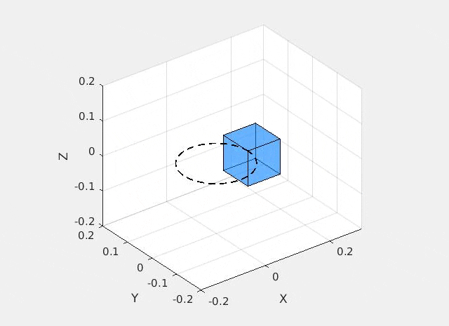

# Constrained-Multibody-Matlab
Quick prototype in Matlab of my [Constrained-Multibody  notes](https://github.com/amcastro-tri/Constrained-Multibody).

Main entry point is **constrained_dynamics.m**.

The demo in **constrained_dynamics.m** sets up a cube falling due to gravity 
with one of its corners constrained to follow a circular path. 

